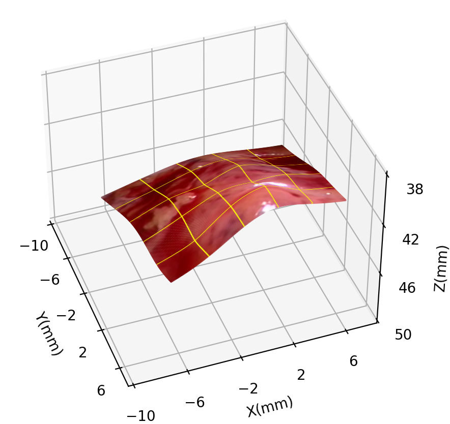

# Reconstructing-Dynamic-Soft-Tissue-with-Stereo-Endoscope-Based-on-a-Single-layer-Network

This is the official TensorFlow implementation for training and testing tpsNet models using the method described in 
>
> **Reconstructing-Dynamic-Soft-Tissue-with-Stereo-Endoscope-Based-on-a-Single-layer-Network**
>
> Bo Yang, Siyuan Xu et al.

#### Overview

<p align="center">
 
</p>

## ✏️ 📄 Citation

If you find our work useful in your research please consider citing our paper:

```
@inproceedings{ ,
  title={Reconstructing-Dynamic-Soft-Tissue-with-Stereo-Endoscope-Based-on-a-Single-layer-Network},
  author={Bo Yang, Siyuan Xu},
  journal={},
  volume={},
  pages={},
  year={2022},
  publisher={}
}
```

## ⚙️ Setup

We run our experiments with TensorFlow 1.14.0, CUDA 9.2, Python 3.6.12 and Ubuntu 18.04.

## 💾 Datasets

You can download the [EndoSLAM dataset](https://data.mendeley.com/datasets/cd2rtzm23r/1) and the [Hamlyn dataset](http://hamlyn.doc.ic.ac.uk/vision/).

**preprocess**

we rectified stereo images sampled from the in-vivo endoscopy stereo video.

**split**

We train first 200 frame data of in-vivo endoscopy stereo dataset and test frame 201 to 300.

## ⏳ In vivo training

**Standard TPS training:**

Create A matrix:

```shell
CUDA_VISIBLE_DEVICES=0 python create_A.py --interp_height 200 --interp_width 200 --interp_top 0 \
--interp_left 0 --feature_row 4 --feature_col 4 --save_path <path_to_save_A_file>
```

Training step:

set `--continue_training True` to reconstruct multiple disparity using last trained feature in need.

```shell
CUDA_VISIBLE_DEVICES=0 python fullZ_total.py --mode 'FEATURE' --cpts_row 4 --cpts_col 4 --A_directory <path_to_load_A_file> \
--output_directory <path_to_save_result> --continue_training True
```

**Alternative TPS training:**


Training step:
```shell
CUDA_VISIBLE_DEVICES=0 python fullZ_train_test.py --mode train --cpts_row 4 --cpts_col 4 --A_directory <path_to_load_A_file> \
--output_directory <path_to_save_result>
```
Test step:
```shell
CUDA_VISIBLE_DEVICES=0 python fullZ_train_test.py --mode test --cpts_row 4 --cpts_col 4 --A_directory <path_to_load_A_file> \
--output_directory <path_to_save_result> --continue_predict True
```
set `--continue_predict True` to predict using last feature in need

We provide a `main.ipynb` include script above all.


## 3D Reconstruction

we ignore 3d plot code and show result directly. You can find a test reconstruction video in folder `result`.
<p align="center">
 
</p>


## Contact

If you have any questions, please feel free to contact boyang@uestc.edu.cn.
